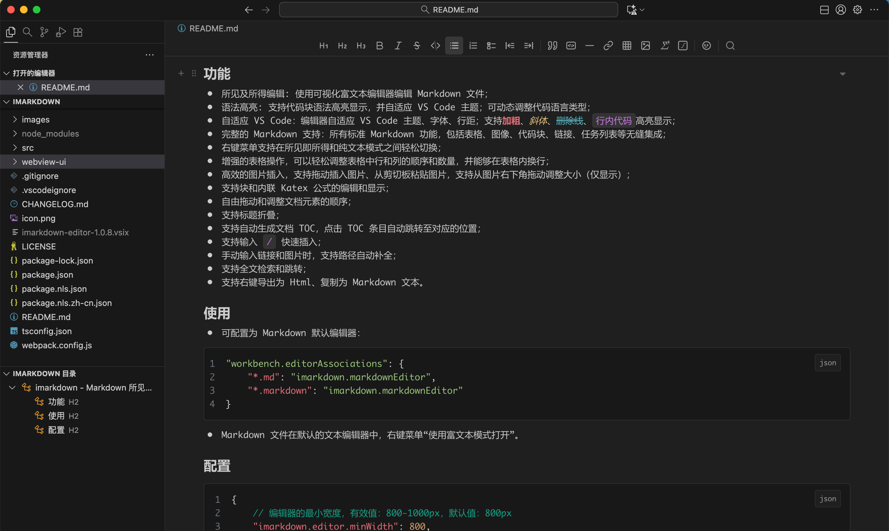

# imarkdown - Markdown 所见即所得编辑器

一个强大的 WYSIWYG（所见即所得）编辑器，适用于 VS Code 和 Cursor 中的 Markdown 文件。使用由 Tiptap 提供支持的可视化富文本界面编辑 Markdown 文件。

从 [VS Code Marketplace](https://marketplace.visualstudio.com/items?itemName=shy1248.imarkdown-editor) 安装。



## 功能

- 所见及所得编辑: 使用可视化富文本编辑器编辑 Markdown 文件，右键菜单支持在所见即所得和纯文本模式之间轻松切换；
- Markdown 支持：标准的 Markdown 功能，包括表格、图像、代码块、链接、任务列表等无缝集成；
- 主题配色：自适应 VS Code 主题配色、字体、行距等；
- 语法高亮: 支持代码块语法高亮显示，可动态调整代码语言类型；**加粗**、*斜体*、~~删除线~~、`行内代码`高亮显示；
- 增强的表格操作：可以轻松调整表格中行和列的顺序和数量，并能够在表格内换行；
- 图片插入：支持拖动插入图片、从剪切板粘贴图片，支持从图片右下角拖动调整大小（仅显示）；
- 数学公式：支持块和内联 Katex 公式的编辑和显示；
- 文档顺序：自由拖动和调整文档元素的顺序；
- 内容折叠：支持按照标题折叠内容；
- TOC：支持自动生成和更新文档 TOC，点击 TOC 条目可跳转至对应的位置；
- 斜杠命令：支持输入 `/` 快速插入命令；
- 路径补全：手动输入链接和图片时，支持路径自动补全；
- 搜索：支持全文检索和跳转；
- 文档导出：支持右键导出为 Html、复制为 Markdown 文本。

## 使用

- 可配置为 Markdown 默认编辑器：

```json
"workbench.editorAssociations": {
    "*.md": "imarkdown.markdownEditor",
    "*.markdown": "imarkdown.markdownEditor"
}
```

- Markdown 文件在默认的文本编辑器中，右键菜单“使用富文本模式打开”。

## 配置

```json
{
    // 编辑器的最小宽度，有效值：800-1000px，默认值：800px
    "imarkdown.editor.minWidth": 800,
    // 编辑器左右的空白距离，有效值：50-100px，默认值：50px
    "imarkdown.editor.padding": 60,
    // 粘贴图片时，图片默认的保存位置
    // 支持vscode变量：${fileDirname}, ${workspaceFolder}, ${fileBasename}, ${fileBasenameNoExtension}
    // 默认值为文档同级目录的 images 目录
    "imarkdown.image.saveDir": "images",
    // 编辑器偏好布局模式：compact，moderate，loose，默认值：moderate
    "imarkdown.editor.layout": "moderate",
    // 是否显示代码块内的行号，默认值：false
    "imarkdown.editor.codeLineNumbers": false
}
```